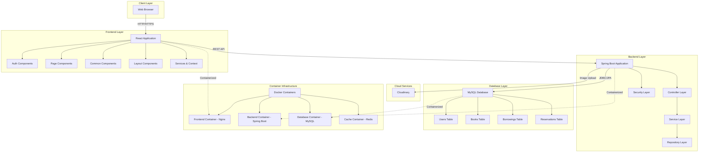
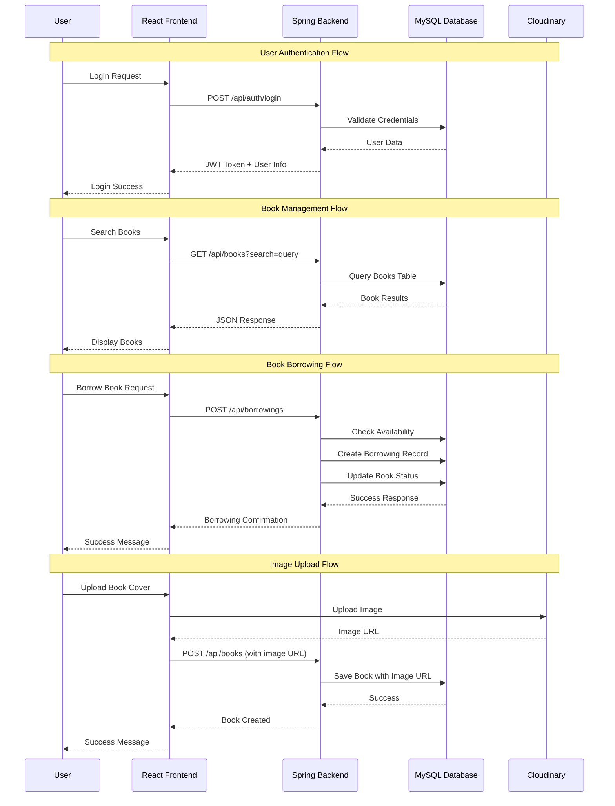
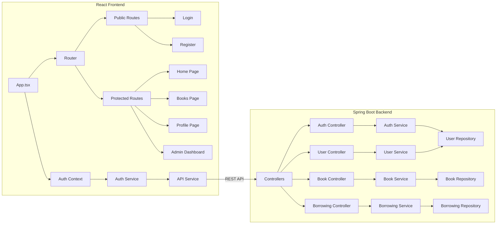

# 📚 Digital Library Management System

A comprehensive digital library management system built with Spring Boot and React, featuring modern web development practices and enterprise-level architecture.

## 🔧 Tech Stack

### Frontend
[](https://reactjs.org/)
[](https://www.typescriptlang.org/)
[](https://www.chartjs.org/)

### Backend
[](https://spring.io/projects/spring-boot)
[](https://spring.io/projects/spring-security)
[](https://jwt.io/)
[](https://maven.apache.org/)
[](https://www.mysql.com/)
[](https://cloudinary.com/)

### Development Tools & Infrastructure
[](https://git-scm.com/)
[](https://www.npmjs.com/)
[](https://www.docker.com/)
[](https://docs.docker.com/compose/)
[](https://redis.io/)

## 🌟 Features

### 📖 Book Management
- **Comprehensive Book Catalog**: Add, search, update, and delete books with detailed metadata
- **Advanced Search & Filtering**: Search by title, author, category, ISBN, and availability
- **Inventory Tracking**: Real-time tracking of available copies and book status
- **Book Details**: Rich book information pages with descriptions, categories, and availability
- **Cloudinary Integration**: Professional image management for book covers

### 👥 User Management & Authentication
- **Secure Authentication**: JWT-based authentication with role-based access control
- **User Registration & Login**: Complete user onboarding with validation
- **Role-Based Access**: Different permissions for users, librarians, and administrators
- **User Profiles**: Comprehensive user profile management with borrowing history
- **Protected Routes**: Frontend route protection based on user roles

### 📋 Borrowing & Returns System
- **Book Checkout**: Streamlined book borrowing process with due date tracking
- **Return Management**: Easy book return with automatic fine calculation
- **Borrowing History**: Complete borrowing history for users and administrators
- **Due Date Tracking**: Automated tracking with overdue notifications
- **Fine Management**: Automatic fine calculation for overdue books

### 🔄 Reservation System
- **Book Reservations**: Place holds on unavailable books
- **Queue Management**: First-come-first-served reservation queue
- **Reservation Notifications**: Automated notifications when books become available
- **Reservation History**: Track all past and current reservations

### 📊 Analytics & Reporting
- **Interactive Dashboards**: Comprehensive admin dashboard with real-time analytics
- **Borrowing Trends**: Visual charts showing borrowing patterns over time
- **Book Categories Analysis**: Distribution charts for book categories
- **Popular Books**: Most borrowed books analytics
- **User Activity Reports**: Detailed user engagement metrics
- **Overdue Reports**: Track and manage overdue books

### 💳 Subscription Management
- **Library Card System**: Digital library card management
- **Subscription Plans**: Multiple subscription tiers with different privileges
- **Payment Integration**: Secure payment processing for subscriptions
- **Subscription Status**: Real-time subscription status tracking

### 🐳 Containerization & Deployment
- **Docker Support**: Complete containerization with multi-stage builds
- **Development Environment**: Hot reload enabled development containers
- **Production Ready**: Optimized production Docker images
- **Service Orchestration**: Docker Compose for multi-service management
- **Health Monitoring**: Built-in health checks for all services
- **Load Balancing**: Nginx reverse proxy configuration
- **Data Persistence**: Volume management for databases and logs

### 🎨 Modern User Interface
- **Responsive Design**: Mobile-first, responsive design for all devices
- **Professional UI/UX**: Clean, modern interface with intuitive navigation
- **Interactive Components**: Dynamic pagination, dropdowns, and modals
- **Data Visualization**: Charts and graphs for analytics using Chart.js and Recharts
- **Loading States**: Professional loading indicators and error handling

## 🛠️ Technology Stack

### Backend
- **Framework**: Spring Boot 3.5.0
- **Language**: Java 17
- **Security**: Spring Security with JWT authentication
- **Database**: MySQL with JPA/Hibernate ORM
- **Build Tool**: Maven
- **Additional Libraries**: 
  - Lombok for boilerplate reduction
  - Spring Validation for input validation
  - Spring Data JPA for database operations

### Frontend
- **Framework**: React 19.1.0 with TypeScript
- **UI Libraries**: 
  - Chart.js & React-ChartJS-2 for data visualization
  - Recharts for advanced charting
- **HTTP Client**: Axios for API communication
- **Routing**: React Router DOM v7.6.2
- **State Management**: React Context API
- **Styling**: CSS3 with responsive design
- **Cloud Services**: Cloudinary for image management

### Development Tools
- **Testing**: Jest, React Testing Library, Spring Boot Test
- **Code Quality**: TypeScript, ESLint configuration
- **Version Control**: Git
- **Package Management**: npm, Maven
- **Containerization**: Docker & Docker Compose
- **Reverse Proxy**: Nginx for load balancing and static file serving
- **Caching**: Redis for session management and performance optimization

## 🏗️ Architecture

### System Architecture Overview


### Data Flow Diagram


### Component Architecture



## 📊 Database Schema

### Core Entities
- **Users**: User authentication and profile information
- **Books**: Complete book catalog with metadata
- **Borrowings**: Book checkout and return tracking
- **Reservations**: Book reservation management
- **Library Cards**: Digital library card system
- **Subscriptions**: Subscription plan management
- **Payment Info**: Payment and billing information

## 🚀 Getting Started

### Quick Start with Docker

#### Prerequisites
- Docker Desktop (Windows/Mac) or Docker Engine (Linux)
- Docker Compose v2.0+
- At least 4GB RAM available for containers

#### Using Docker Scripts

**Windows (PowerShell):**
```powershell
# Production environment
.\docker-setup.bat prod

# Development environment (with hot reload)
.\docker-setup.bat dev

# View status and health checks
.\docker-setup.bat status

# View logs
.\docker-setup.bat logs

# Stop all services
.\docker-setup.bat stop
```

#### Using Docker Compose Directly 

**Production Environment:**
```bash
# Start all services
docker-compose up -d --build

# View logs
docker-compose logs -f

# Stop services
docker-compose down
```

**Development Environment:** (Recommended)
```bash
# Start with hot reload
docker-compose -f docker-compose.dev.yml up -d --build

# View logs
docker-compose -f docker-compose.dev.yml logs -f
```

#### Access Points

**Production Mode:**
- Frontend: http://localhost (port 80)
- Backend API: http://localhost:8080
- Database: localhost:3307 (external access)

**Development Mode:**
- Frontend: http://localhost:3000 (with hot reload)
- Backend API: http://localhost:8080
- Backend Debug: localhost:5005 (Java debug port)
- Database: localhost:3307

---

### Traditional Setup (Without Docker)

#### Prerequisites
- Java 17 or higher
- Node.js 16+ and npm
- MySQL 8.0+
- Maven 3.6+

### Backend Setup
1. **Clone the repository**
   ```bash
   git clone https://github.com/bunchangon711/JavaSpringboot_LibManagement
   cd lib-mangagement
   ```

2. **Configure MySQL Database**
   ```bash
   # Create database
   mysql -u root -p
   CREATE DATABASE librarydb;
   ```

3. **Update application.properties**
   ```properties
   spring.datasource.url=jdbc:mysql://localhost:3306/librarydb
   spring.datasource.username=your_username
   spring.datasource.password=your_password
   ```

4. **Run the Spring Boot application**
   ```bash
   mvn clean install
   mvn spring-boot:run
   ```

### Frontend Setup
1. **Navigate to frontend directory**
   ```bash
   cd frontend
   ```

2. **Install dependencies**
   ```bash
   npm install
   ```

3. **Start the development server**
   ```bash
   npm start
   ```

4. **Access the application**
   - Frontend: http://localhost:3000
   - Backend API: http://localhost:8080

---

## 🐳 Docker Setup

### Quick Start Commands

**Windows (PowerShell):**
```powershell
# Test Docker setup (recommended first step)
.\docker-test.bat

# Production environment
.\docker-setup.bat prod

# Development environment
.\docker-setup.bat dev

# Check status
.\docker-setup.bat status
```

**Linux/Mac:**
```bash
# Test Docker setup
chmod +x docker-test.sh
./docker-test.sh

# Production environment
chmod +x docker-setup.sh
./docker-setup.sh prod
```

### Common Issues & Solutions

#### 1. **Docker Image Not Found Errors**
```
failed to solve: openjdk:17-jre-slim: not found
```
**Solution**: Updated to use `eclipse-temurin:17-jre` (latest stable OpenJDK image)

#### 2. **Frontend Build Fails (User Creation Error)**
```
addgroup: group 'nginx' in use
```
**Solution**: Fixed Dockerfile to not recreate existing nginx user

#### 3. **Build Dependencies Missing**
```
npm ci --only=production
```
**Solution**: Changed to `npm ci` to include dev dependencies needed for build

#### 4. **Port Conflicts**
If you see port already in use errors:
```powershell
# Check what's using the port
netstat -ano | findstr :8080  # Windows
lsof -i :8080                 # Linux/Mac

# Change ports in docker-compose.yml if needed
```

#### 5. **Version Attribute Warning**
```
the attribute `version` is obsolete
```
**Solution**: Removed obsolete `version: '3.8'` from docker-compose files

For detailed Docker documentation, see [DOCKER.md](DOCKER.md).

---

## 📱 API Endpoints

### Authentication
- `POST /api/auth/login` - User login
- `POST /api/auth/register` - User registration

### Books
- `GET /api/books` - Get all books with pagination
- `GET /api/books/{id}` - Get book details
- `POST /api/books` - Add new book (Admin)
- `PUT /api/books/{id}` - Update book (Admin)
- `DELETE /api/books/{id}` - Delete book (Admin)

### Borrowings
- `POST /api/borrowings` - Borrow a book
- `PUT /api/borrowings/{id}/return` - Return a book
- `GET /api/borrowings/user/{userId}` - Get user borrowings
- `GET /api/borrowings` - Get all borrowings (Admin)

### Reservations
- `POST /api/reservations` - Create reservation
- `GET /api/reservations/user/{userId}` - Get user reservations
- `DELETE /api/reservations/{id}` - Cancel reservation

### Users
- `GET /api/users` - Get all users (Admin)
- `GET /api/users/{id}` - Get user details
- `PUT /api/users/{id}` - Update user profile

### Reports
- `GET /api/reports/borrowing-trends` - Borrowing trends data
- `GET /api/reports/popular-books` - Most popular books
- `GET /api/reports/book-categories` - Book category distribution

## 🔐 Security Features

- **JWT Authentication**: Secure token-based authentication
- **Role-Based Access Control**: Different permissions for users and administrators
- **Protected Routes**: Frontend route protection
- **Input Validation**: Comprehensive server-side validation
- **CORS Configuration**: Secure cross-origin resource sharing
- **Password Security**: Encrypted password storage

## 📈 Key Highlights

### Object-Oriented Programming Concepts
- **Inheritance**: User roles with different privileges
- **Polymorphism**: Multiple user types with varying behaviors
- **Encapsulation**: Private fields with controlled access
- **Abstraction**: Service interfaces and repository patterns

### System Design Principles
- **Layered Architecture**: Clear separation of concerns
- **RESTful API Design**: Standard HTTP methods and status codes
- **Database Normalization**: Optimized relational database design
- **Error Handling**: Comprehensive exception management
- **Scalable Structure**: Modular and maintainable codebase

### Modern Development Practices
- **TypeScript**: Type-safe frontend development
- **Responsive Design**: Mobile-first approach
- **Component Reusability**: Modular React components
- **State Management**: Efficient state handling with Context API
- **API Integration**: Seamless frontend-backend communication

## 🧪 Testing

### Backend Testing
```bash
mvn test
```

### Frontend Testing
```bash
cd frontend
npm test
```


## 👥 Contributing

1. Fork the repository
2. Create a feature branch (`git checkout -b feature/AmazingFeature`)
3. Commit your changes (`git commit -m 'Add some AmazingFeature'`)
4. Push to the branch (`git push origin feature/AmazingFeature`)
5. Open a Pull Request

---

## 🖼️ Video show case

https://github.com/user-attachments/assets/04caa11b-f0c0-4a3d-bb39-ecfb81774f3b

---

⭐ **Star this repository if you found it helpful!**

Built with ❤️ using Spring Boot and React
